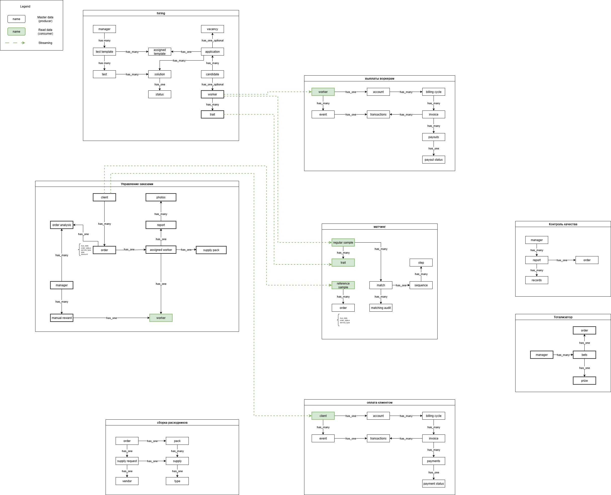

Схемы v2
======

Поддомены
------
| Поддомен | Обоснование |
|------------|------------|
| Управление заказами | Все что от носится к заказу: оформление, сборка, выплаты воркерам, оплата заказов клиентом. Платежи тесно связаны с заказом и без заказов не имеют смысла, компания отдельно не занимается платежами (как проблемой бизнеса). |
| Найм | Привлечение и отбор высококвалифицированных исполнителей для выполнения заказов. Ключевая компетенция бизнеса, определяющая качество предоставляемых услуг. |
| Матчинг | Матчинг воркеров по характеристикам под конкретного клиента для выполнения заказа. Конкурентное преимущество бизнеса. |
| Управление качеством | Поддержание качества услуг на должном уровне, эта отдельная проблема по улучшению процессов. Включает в себя сбор обратной связи от клиентов и анализ, способствует выработке новых гипотез по улучшению бизнеса. |
| Мотивация персонала | Проблема по вовлеченности и эффективности менеджеров. |

Типы поддоменов
------

| Вид поддомена | Конкурентное преимущество | Сложность | Изменчивость | Варианты реализации | Интерес проблемы | Предполагаемый тип поддомена |
|------------|------------|------------|------------|------------|------------|------------|
| Управление заказами | нет | низкая | низкая | ??? | средний  | supporting |
| Найм | да | высокая | частая | ??? | высокий  | core |
| Матчинг | да | высокая | частая | ??? | высокий  | core |
| Управление качеством | нет | средняя | редкая | ??? | низкий  | supporting |
| Мотивация персонала | нет | низкая | редкая | купить готовое решение | низкий  | generic |

Domain chart
------

Bounded contexts
------

Bounded contexts map
------

Сравнение bounded contexts с предыдущей версией
------

### Отличие 1
_Биллинг и аккаунтинг_ превратился в два раздельных контекста, каждый из которых содержит свой общий язык и решает определенную проблему поддомена (оплаты и выплаты)

### Отличие 2
_Управление качеством_ и _мотивация персонала_ это два новых поддомена, каждый из которых содержит свой контекст. Ранее _контроль качества_ и _тотализатор_ были частью большого контекста _Управление заказами_.

Event Storming
------
[Event Storming](./mcf_eventstorming_subdomains.pdf)

Data model
------

Характеристики
------

| Характеристики | Источник |
|------------|------------|
| avaialability, scalability, securability | [US-081] Мы ожидаем 1к заявок в день от рандомных котов, также, судя по отзывам, наши конкуренты могут попытаться нас заддосить в этом месте. Они так делали уже несколько раз с другими компаниями, после чего компании закрывались с позором. |
| agility, testability, deployability | Низкий ТТМ |
| agility, modifiability, testability, deployability | Для бизнеса критично проверять новые гипотезы по отсеву котов и изменять уже существующие с максимальной скоростью и надёжностью. [US-070] Алгоритм матчинга.|
| agility, testability, deployability, scalability, availability, fault tolerance | Конкурентное преимущество (найм + матчинг) |
| availability, continuity, reliability, еxtensibility, modifiability, maintainability, supportability, readability, accessibility, security, usability | 2 core-поддомена (найм + матчинг) являются конкурентным преимуществом |
| maintainability, readability, supportability | 2 supporting-поддомена |
| installability, readability, supportability | 1 generic-поддомен |

Архитектурный стиль
------
Выделим наиболее важные для проекта характеристики и обозначим их на таблице архитектурных стилей.

Бизнес развивается по изменяющимся требованиям и активно проверяет новые гипотезы, что требует гибкости и возможности вносить изменения с минимальными рисками. При этом часть поддоменов (в частности _Найм_ и _Матчинг_) являются ключевыми для компании, отлючаются высокой сложностью и частым внесенем изменений.

Для обеспечения требуемых архитектурных характерестик - низкого TTM, высокой modifiability, availability и способности к экспериментам - выбрана микросервисная архитектура.
***

Коммуникации
------

