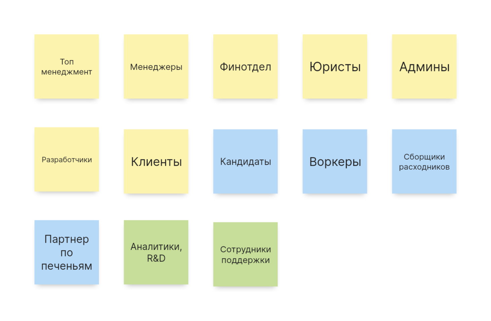
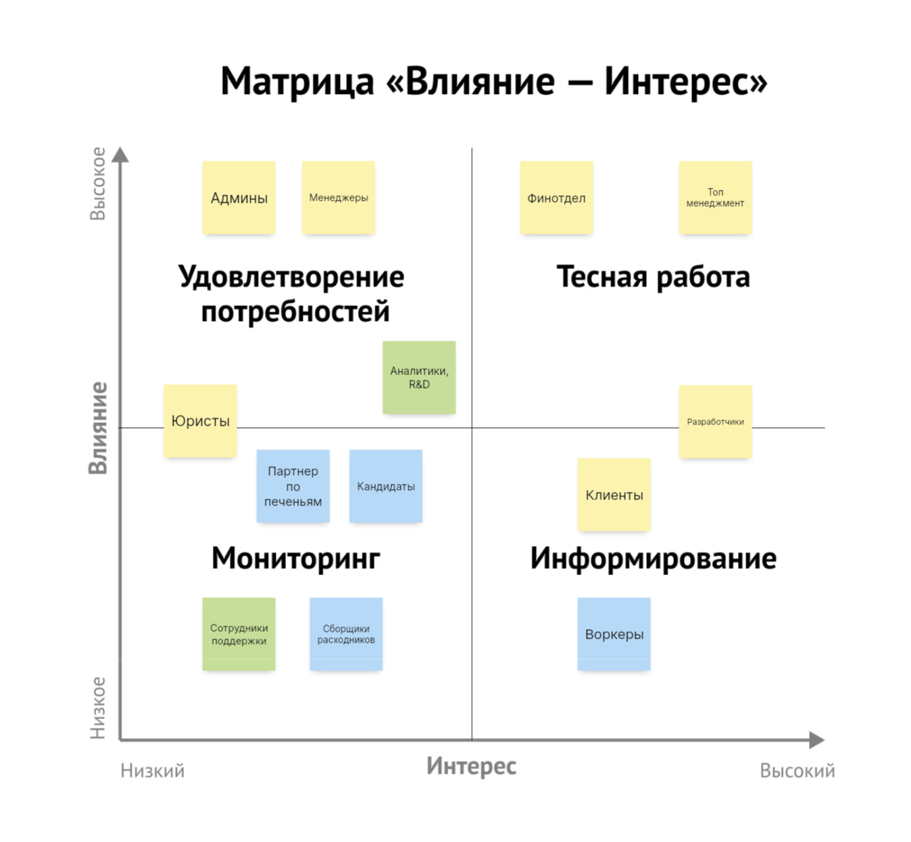
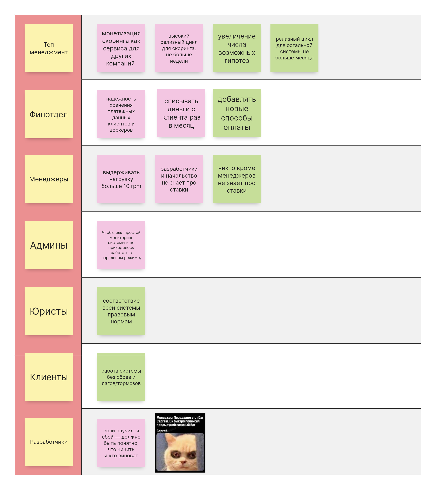

Схемы v3
======

Стейкхолдеры
------

### внешние/операционные
Получились из обязанностей компании — те, кто непосредственно участвует в процессах.

### дополнительные, логически выведенные из требований
С сотрудниками поддержки думаю все понятно: при росте количества заказов неизбежно возникают проблемы, которые нужно решать — без службы поддежки тут никак не обойтись. Аналитики и R&D это больше про сбор/анализ данных для проверки гипотез, появление вытекает из требований по отсеву кандидатов.

Матрица влияние-интерес
------

Консёрны
------

Ограничения
------
- инфраструктуру считаем бесплатной
- соблюдение CatFinComplience

| Характеристики | Источник |
|------------|------------|
| avaialability, scalability, securability | [US-081] Мы ожидаем 1к заявок в день от рандомных котов, также, судя по отзывам, наши конкуренты могут попытаться нас заддосить в этом месте. Они так делали уже несколько раз с другими компаниями, после чего компании закрывались с позором. |
| agility, testability, deployability | Низкий ТТМ |
| agility, modifiability, testability, deployability | Для бизнеса критично проверять новые гипотезы по отсеву котов и изменять уже существующие с максимальной скоростью и надёжностью. [US-070] Алгоритм матчинга.|
| agility, testability, deployability, scalability, availability, fault tolerance | Конкурентное преимущество (найм + матчинг) |
| availability, continuity, reliability, еxtensibility, modifiability, maintainability, supportability, readability, accessibility, security, usability | 2 core-поддомена (найм + матчинг) являются конкурентным преимуществом |
| maintainability, readability, supportability | 2 supporting-поддомена |
| installability, readability, supportability | 1 generic-поддомен |
| deployability | консерн топ-менеджеров |
| сonsistency | требования к финансовым операциям |
