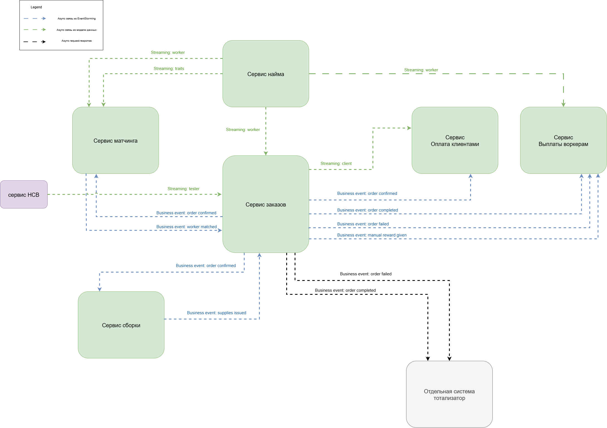

Схемы v3
======

Стейкхолдеры
------

### внешние/операционные
Получились из обязанностей компании — те, кто непосредственно участвует в процессах.

### дополнительные, логически выведенные из требований
С сотрудниками поддержки думаю все понятно: при росте количества заказов неизбежно возникают проблемы, которые нужно решать — без службы поддежки тут никак не обойтись. Аналитики и R&D это больше про сбор/анализ данных для проверки гипотез, появление вытекает из требований по отсеву кандидатов.

Матрица влияние-интерес
------

Консёрны
------

Обновленные bounded contexts
------

Ограничения
------
- инфраструктуру считаем бесплатной
- соблюдение CatFinComplience

Характеристики
------
При описании не стал делать картинками, часть характеристик у нас из второй домашки, другая - из консернов. Хотел, конечно, красиво накидать с ~блекджеком и ш...~ стикерами, но на это просто не хватило времени.

| Характеристики | Источник |
|------------|------------|
| avaialability, scalability, securability | [US-081] Мы ожидаем 1к заявок в день от рандомных котов, также, судя по отзывам, наши конкуренты могут попытаться нас заддосить в этом месте. Они так делали уже несколько раз с другими компаниями, после чего компании закрывались с позором. |
| agility, testability, deployability | Низкий ТТМ |
| agility, modifiability, testability, deployability | Для бизнеса критично проверять новые гипотезы по отсеву котов и изменять уже существующие с максимальной скоростью и надёжностью. [US-070] Алгоритм матчинга.|
| agility, testability, deployability, scalability, availability, fault tolerance | Конкурентное преимущество (найм + матчинг) |
| availability, continuity, reliability, еxtensibility, modifiability, maintainability, supportability, readability, accessibility, security, usability | 2 core-поддомена (найм + матчинг) являются конкурентным преимуществом |
| maintainability, readability, supportability | 2 supporting-поддомена |
| installability, readability, supportability | 1 generic-поддомен |
| deployability | консерн топ-менеджеров |
| сonsistency | требования к финансовым операциям |
| observability, monitorability | консерн админов и разработчиков |

Выбор архитектуры
------
### Архитектурный стиль

Бизнес развивается по изменяющимся требованиям и активно проверяет новые гипотезы, что требует гибкости и возможности вносить изменения с минимальными рисками. При этом часть поддоменов (в частности Найм и Матчинг) являются ключевыми для компании, отлючаются высокой сложностью и частым внесенем изменений.

Для обеспечения требуемых архитектурных характерестик - низкого TTM, высокой modifiability, availability и способности к экспериментам - выбрана микросервисная архитектура.

### Выплаты воркерам
Есть ограничение на соблюдение CatFinComplience. Будем делать отдельным сервисом

### Оплата клиентами
Есть ограничение на соблюдение CatFinComplience. По модели данных схож с *Выплаты воркерам*, но имеет немного другой общий язык, другой релизный цикл и выше modifiability за счет добавлениях новых способов оплаты.

### Найм
Релизный цикл, согласно требованию топ-менеджеров - 1 неделя, против месячного цикла у других конекстов. Придется вынести в отдельный сервис.

### Тотализатор
Покупаем готовое решение или используем готовый сервис. Сами не делаем, не является приоритетом бизнеса.

### Сборка расходников
Отдельный сервис, так как находится в своем поддомене. Нагрузка по требованиям увиличилась и лучше держать отдельно, при начальных требованиях - модулем в монолите было бы лучше.

### Матчинг
Конкурентное преимущество. Влияет на точность, скорость и надежность подбора — ключевые бизнес-метрики компании.

### Управление заказами и контроль качества
Можно объединить в один сервис, архитектурные характеристики одинаковые, решают проблемы supporting-поддомена. Разделение на два сервиса не дает дополнительных преимуществ с точки зрения бизнес логики и данных.

Выбор архитектуры и БД сервисов
------

| Сервис | Архитектура | Тип БД | Обоснование |
|------------|------------|------------|------------|
| Выплаты воркерам | layered | Реляционная БД | Соблюдение CatFinComplience и consistency — реляционная СУБД |
| Оплата клиентами | layered | Реляционная БД | Соблюдение CatFinComplience и consistency — реляционная СУБД |
| Найм | microkernel | Реляционная БД | Тесты могут отличаться от кандидата к кандидату, так же как и применяемые алгоритмы скоринга. Из этого следует, что каждый тест представляет собой по сути отдельный плагин, а ядро системы выступает в роли оркрестратора. Данные структурированы и имеют отношения — реляционная СУБД  |
| Матчинг | pipeline | Графовая БД | Алгоритм состоит из набора различных шагов, сами шаги могут быть в разном порядке. Кроме того, много связей по сущностям и сложные отношения, с учетом сильных/слабых сторон каждого воркера — Графовая БД |
| Сборка расходников | layered | Реляционная БД | Данные структурированы и имеют отношения — реляционная СУБД |
| Управление заказами и контроль качества | modular monolith | Реляционная БД | Модульный монолит с публичными интерфейсами у каждого модуля |

Вид коммуникаций
------
Бизнесовые связи выбираем асинхронными, поскольку системы не зависят друг от друга и нет требований к strong consistency.  
Для CUD стриминга также подойдут асинхронные взаимодействия  
Для интеграций с внешними системами используем асинхронный request-response через фоновые воркеры или джобы — мгновенное уведомление о событиях в системе не требуется.

