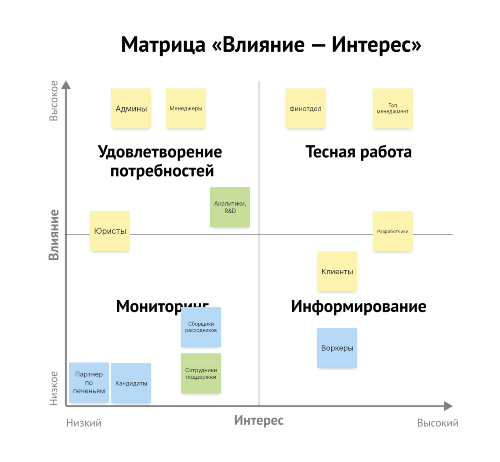

Схемы v3
======

Стейкхолдеры
------

### внешние/операционные
Получились из обязанностей компании — те, кто непосредственно участвует в процессах.

### дополнительные, логически выведенные из требований
С сотрудниками поддержки думаю все понятно: при росте количества заказов неизбежно возникают проблемы, которые нужно решать — без службы поддежки тут никак не обойтись. Аналитики и R&D это больше про сбор/анализ данных для проверки гипотез, появление вытекает из требований по отсеву кандидатов.

Матрица влияние-интерес
------

Консёрны
------

