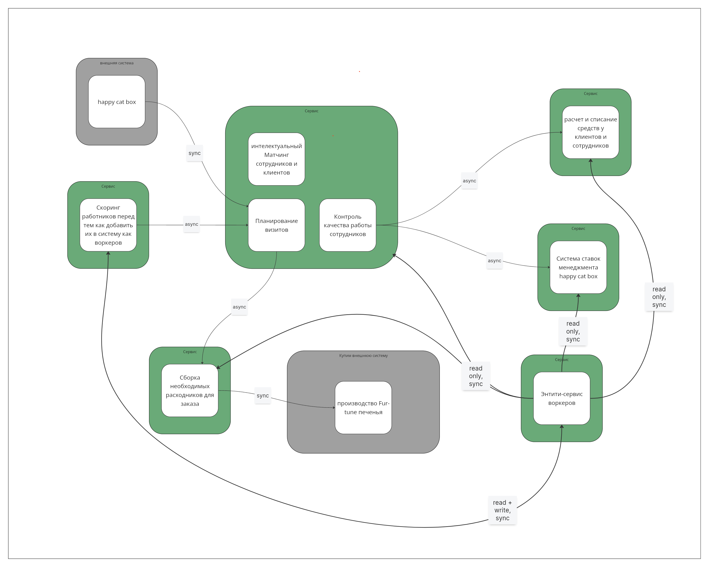
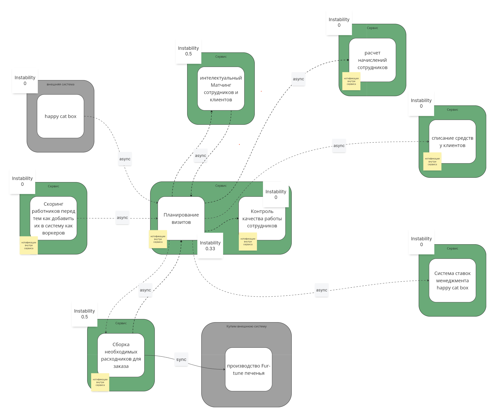
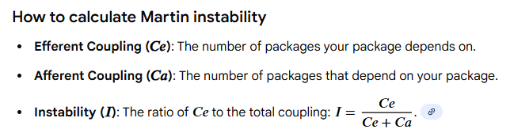
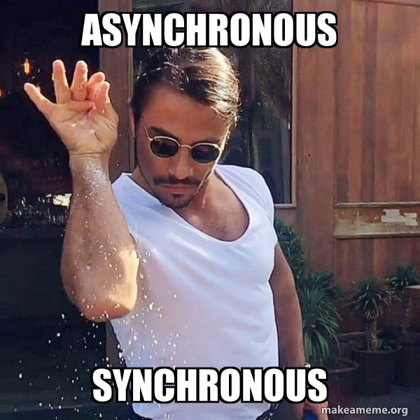
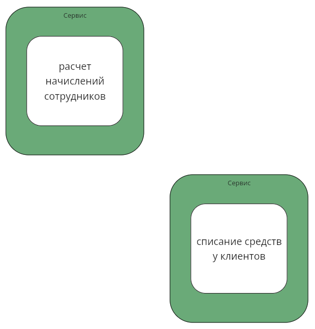
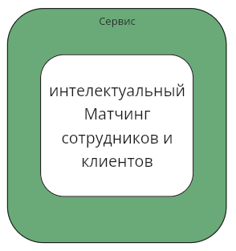
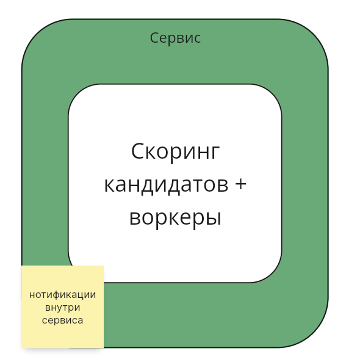

Схемы v4
======
Текущая система
------

Целевая система
------

Подсчет Instability
------
Подсчет сделан на скринах с текущей и целевой системами. P.S. здесь в очередной раз запутался как это правильно считать с асинхронными связями, взаимодействие с каждым сервисом отдельно или вместе. Потом была инфа, что считать по потоку данных. Вообщем тут оставил как есть, возможно не совсем правильно.

Почитал Мартина и здесь вероятно нужно считать зависимости по контрактам, консьюмер - +1 зависимость *CE*, продьюсер - +1 зависимость *CA*.

План по распиливанию системы
------
### Есть свободные люди и ресурсы
Начинем со смены коммуникации в HCB на *async* (event-driven). Это самое простое, что можно сделать в текущей системе.

Меням связи в Entity-service с sync на *async* (event-driven). Так нам будет проще потом распилить монолит с финансами.

Далее следует разделить *монолит по оплатам и выплатам* на два отдельных сервиса. Подход будем использовать *Data first*, т.к. это разные bounded-контексты, модель данных расходится (хоть и похожа).

Далее выносим сервис матчинга, используем подход *Data first* (у нас меняется тип БД). Коммуникации делаем *async* (event-driven).

На десерт оставляем объединение скоринга с entity-сервисом

### Есть опыт и инфраструктура
Для начала стоит определить, что распиливать первым из сервисов для core-поддоменов: найм или матчинг. Матчинг у нас — часть монолита, а найм разделен на сервис скоринга и entity-сервис воркеров. Последний самый нестабильный к изменениям и тянет за собой много зависимостей от других сервисов, поэтому начнем с него. Коммуникации делаем *async* (event-driven).

Почему же не матчинг первым: матчинг имеет связь только внутри монолита, и вынос его в отдельный сервис первым повлияет только на монолит. ОБъединение скоринга и entity-service затрагивает всю систему целиком и даёт больший эффект.

Далее выносим сервис матчинга, используем подход *Data first* (у нас меняется тип БД). Коммуникации делаем *async* (event-driven).

После распиливает *монолит по оплатам и выплатам* на 2 разных сервиса. Подход будем использовать *Data first*, т.к. это разные bounded-контексты, модель данных расходится (хоть и похожа).

После меняем коммуникацию с HCB *async* (event-driven).
